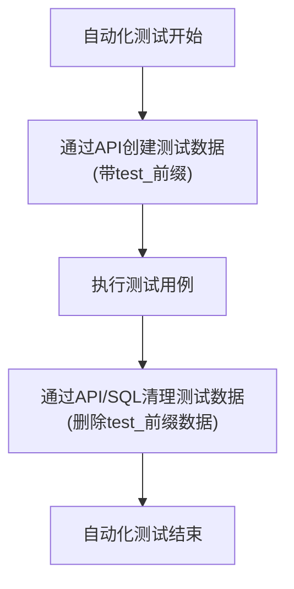
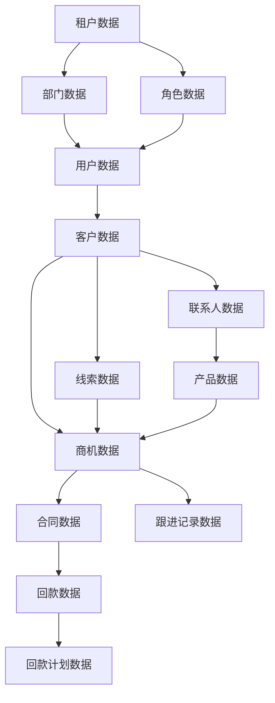

# CRM全系统测试数据方案设计文档

**文档编号**：CRMTST-DATA-001  
**版本**：V1.0  
**编制人**：安炳琨（质量专员）  
**编制日期**：2026-07-14  
**适用范围**：MIT-FMP / mitedtsm CRM 全系统开发冲刺

---

## 3.1 数据范围与量级定义

根据P0主链（线索→客户→商机→合同→回款），测试数据定义如下：

| 数据实体 | 用途 | 最少数量 | 数据特征 |
|---------|------|---------|---------|
| 租户 | 验证多租户隔离 | 2个 | 正常租户数据 |
| 部门 | 验证部门级数据权限 | 3个 | 销售部、财务部、管理部 |
| 角色 | 验证不同角色权限 | 5个 | 系统管理员、销售代表、销售经理、财务专员、审批人 |
| 用户 | 验证不同用户的数据范围 | 10个 | 每个角色至少2个用户 |
| 客户 | 验证客户管理流程 | 50个 | 正常客户20个、重复客户5个、公海客户10个、无效数据15个 |
| 联系人 | 验证联系人管理 | 80个 | 正常联系人60个、无效联系人20个 |
| 线索 | 验证线索转化流程 | 30个 | 正常线索20个、无效线索5个、待分配线索5个 |
| 产品 | 验证报价和产品关联 | 20个 | 不同类别、不同价格区间的产品 |
| 商机 | 验证商机生命周期 | 40个 | 各阶段商机：线索阶段5个、已验证5个、方案5个、谈判5个、赢单10个、丢单10个 |
| 合同 | 验证合同审批流程 | 20个 | 草稿5个、审批中5个、已通过5个、已驳回5个 |
| 回款 | 验证回款管理 | 25个 | 正常回款10个、部分回款5个、超额回款5个、逾期回款5个 |
| 回款计划 | 验证回款计划 | 30个 | 正常计划20个、逾期计划10个 |
| 跟进记录 | 验证跟进联动 | 100个 | 不同类型的跟进记录 |
| 操作日志 | 验证审计追溯 | 自动生成 | 由系统自动记录 |

---

## 3.2 租户/部门/角色/用户数据集

### 3.2.1 租户数据

| 租户ID | 租户名称 | 域名 | 状态 |
|--------|---------|------|------|
| 1 | 测试租户A | test-a.example.com | 正常 |
| 2 | 测试租户B | test-b.example.com | 正常 |

### 3.2.2 部门数据

| 部门ID | 部门名称 | 父部门ID | 租户ID |
|--------|---------|---------|--------|
| 100 | 销售部 | 0 | 1 |
| 101 | 销售一组 | 100 | 1 |
| 102 | 销售二组 | 100 | 1 |
| 200 | 财务部 | 0 | 1 |
| 300 | 管理层 | 0 | 1 |

### 3.2.3 角色数据

| 角色ID | 角色名称 | 权限范围 |
|--------|---------|---------|
| 1 | 系统管理员 | 全部数据 |
| 2 | 销售代表 | 本人数据 |
| 3 | 销售经理 | 本部门及下属数据 |
| 4 | 财务专员 | 财务相关数据 |
| 5 | 审批人 | 审批相关数据 |

### 3.2.4 用户数据

| 用户ID | 用户名 | 密码 | 角色 | 部门 | 租户ID |
|--------|--------|------|------|------|--------|
| 1 | admin | admin123 | 系统管理员 | 管理层 | 1 |
| 2 | sales01 | sales123 | 销售代表 | 销售一组 | 1 |
| 3 | sales02 | sales123 | 销售代表 | 销售一组 | 1 |
| 4 | sales03 | sales123 | 销售代表 | 销售二组 | 1 |
| 5 | sales04 | sales123 | 销售代表 | 销售二组 | 1 |
| 6 | sales_mgr01 | mgr123 | 销售经理 | 销售一组 | 1 |
| 7 | sales_mgr02 | mgr123 | 销售经理 | 销售二组 | 1 |
| 8 | finance01 | fin123 | 财务专员 | 财务部 | 1 |
| 9 | finance02 | fin123 | 财务专员 | 财务部 | 1 |
| 10 | approver01 | app123 | 审批人 | 管理层 | 1 |

---

## 3.3 业务主数据准备清单

### 3.3.1 客户数据

| 数据类型 | 数量 | 特征 | 用途 |
|---------|------|------|------|
| 正常客户 | 20个 | 完整信息、不同行业、不同来源 | 测试客户CRUD、分配、转移 |
| 重复客户 | 5个 | 重复的名称或联系方式 | 测试重复校验 |
| 公海客户 | 10个 | 无负责人、超过30天无跟进 | 测试公海领取、自动掉入公海 |
| 无效数据 | 15个 | 空值、非法格式、超出范围 | 测试输入校验 |

### 3.3.2 产品数据

| 产品ID | 产品名称 | 类别 | 单价 | 状态 |
|--------|---------|------|------|------|
| 1 | 基础版服务 | 服务类 | 10000 | 正常 |
| 2 | 专业版服务 | 服务类 | 30000 | 正常 |
| 3 | 旗舰版服务 | 服务类 | 50000 | 正常 |
| 4 | 硬件设备A | 硬件类 | 8000 | 正常 |
| 5 | 硬件设备B | 硬件类 | 15000 | 正常 |

### 3.3.3 合同/订单数据

| 数据类型 | 数量 | 特征 | 用途 |
|---------|------|------|------|
| 草稿合同 | 5个 | 未提交审批 | 测试合同编辑、删除 |
| 审批中合同 | 5个 | 已提交待审批 | 测试审批流程 |
| 已通过合同 | 5个 | 审批通过 | 测试回款关联、数据统计 |
| 已驳回合同 | 5个 | 审批驳回 | 测试修改重提 |

### 3.3.4 商机数据

| 阶段 | 数量 | 特征 | 用途 |
|------|------|------|------|
| 线索 | 5个 | 刚创建，未验证 | 测试阶段推进规则 |
| 已验证 | 5个 | 验证线索有效性 | 测试阶段推进规则 |
| 方案 | 5个 | 已提供解决方案 | 测试阶段推进规则 |
| 谈判 | 5个 | 正在商务谈判 | 测试阶段推进规则、赢单/输单 |
| 赢单 | 10个 | 已成功签约 | 测试合同关联、数据统计 |
| 丢单 | 10个 | 已失败 | 测试输单原因、数据统计 |

---

## 3.4 异常与边界测试数据

### 3.4.1 业务规则边界数据

| 业务规则 | 边界数据 | 预期结果 |
|---------|---------|---------|
| 商机阶段不可回退 | 处于"谈判"阶段的商机，尝试退回到"方案"阶段 | 系统拒绝操作，提示"阶段不可回退" |
| 回款金额不能超额 | 合同金额100000元，已回款90000元，尝试回款20000元 | 系统拒绝操作，提示"回款金额超出剩余金额" |
| 客户数量上限 | 销售代表已达客户数量上限（根据配置），尝试分配新客户 | 系统拒绝操作，提示"已达客户数量上限" |
| 公海领取上限 | 销售代表已达公海领取上限，尝试领取公海客户 | 系统拒绝操作，提示"已达公海领取上限" |

### 3.4.2 格式校验数据

| 字段类型 | 非法数据 | 预期结果 |
|---------|---------|---------|
| 手机号 | 123456、1380013800、138001380000 | 系统拒绝保存，提示"手机号格式不正确" |
| 邮箱 | test@、@example.com、test.example.com | 系统拒绝保存，提示"邮箱格式不正确" |
| 金额 | -100、abc、100.000 | 系统拒绝保存，提示"金额格式不正确"或"金额不能为负数" |
| 日期 | 2026-13-01、2026-02-30 | 系统拒绝保存，提示"日期格式不正确" |

### 3.4.3 权限越权场景

| 场景 | 测试账号 | 测试操作 | 预期结果 |
|------|---------|---------|---------|
| 查看其他用户客户 | sales02（销售代表） | 查看sales01的客户 | 系统拒绝，提示"无权限查看此数据" |
| 编辑其他部门商机 | sales03（销售二组） | 编辑销售一组的商机 | 系统拒绝，提示"无权限操作此数据" |
| 跨租户访问 | 租户A用户 | 访问租户B的数据 | 系统拒绝，提示"无权限访问" |
| 删除他人合同 | sales01（销售代表） | 删除sales02创建的合同 | 系统拒绝，提示"无权限删除此数据" |

---

## 3.5 测试数据的来源与生成方式

### 3.5.1 现有测试数据相关文件

经搜索，项目中**暂无** `test-data` 目录、`data.sql` 或 `fixture` 相关文件，需要新建。

### 3.5.2 推荐数据生成方案

#### 方案A：手工SQL脚本插入（适合基础数据）

**适用场景**：租户、部门、角色、用户等基础数据

**生成方式**：
1. 在 `database/new` 目录下创建 `crm-test-data.sql` 文件
2. 编写INSERT语句，包含所有基础数据
3. 通过Docker Compose初始化或手动执行

**示例**：
```sql
-- 租户数据
INSERT INTO system_tenant (id, name, domain, status) VALUES (1, '测试租户A', 'test-a.example.com', 0);
INSERT INTO system_tenant (id, name, domain, status) VALUES (2, '测试租户B', 'test-b.example.com', 0);

-- 部门数据
INSERT INTO system_dept (id, name, parent_id, tenant_id) VALUES (100, '销售部', 0, 1);
```

#### 方案B：AI生成批量测试数据（适合业务数据）

**适用场景**：客户、联系人、商机、合同等业务数据

**生成方式**：
1. 定义数据生成规则（字段、数量、数据特征）
2. 使用AI工具生成符合规则的测试数据
3. 导出为SQL或CSV格式
4. 由模块开发者核验数据准确性后导入

**数据规则示例**：
- 客户名称：随机生成企业名称（如"北京XX科技有限公司"）
- 客户行业：随机选择（IT、金融、制造、零售、教育）
- 客户来源：随机选择（官网、转介绍、展会、电话营销）
- 联系人姓名：随机生成中文姓名
- 手机号：11位随机手机号（脱敏处理）

#### 方案C：通过API动态创建和清理（适合自动化测试）

**适用场景**：自动化测试脚本中的测试数据

**生成方式**：
1. 编写API测试脚本，通过API创建测试数据
2. 测试完成后，通过API或SQL清理测试数据
3. 使用标签或前缀标识测试数据（如`test_`前缀）

**示例流程**：


### 3.5.3 数据导入顺序依赖图



### 3.5.4 数据管理规则

| 规则 | 说明 |
|------|------|
| 数据隔离 | 测试数据与生产数据严格隔离，使用独立的测试环境 |
| 数据标识 | 所有测试数据必须带有标识（如`test_`前缀或特定租户），便于清理 |
| 数据备份 | 定期备份测试数据，防止数据丢失 |
| 数据清理 | 测试完成后及时清理测试数据，保持环境干净 |
| 数据验证 | AI生成的数据必须经过人工核验，确保符合业务规则 |

---

## 附录：关键代码搜索证据清单

| 证据类别 | 文件路径 | 说明 |
|---------|---------|------|
| CRM数据库表 | `database/base/crm-2024-09-30.sql` | CRM现有表结构 |
| 系统数据库表 | `database/base/ruoyi-vue-pro.sql` | 租户、部门、角色、用户表 |
| 开发计划 | `15-全CRM差异补齐任务分工与Git协同开发计划 (1).md` | 测试数据最低集要求 |
| 差异表 | `原型-现有差异表.md` | 功能点和数据需求 |
| Docker配置 | `docker-compose/docker-compose.yml` | 数据库初始化配置 |

---

**文档版本记录**

| 版本 | 日期 | 修改人 | 修改内容 |
|------|------|--------|---------|
| V1.0 | 2026-07-14 | 安炳琨 | 初始版本，包含全部5个子任务 |