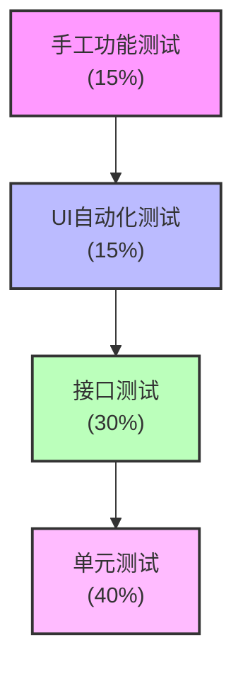
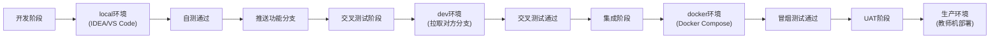
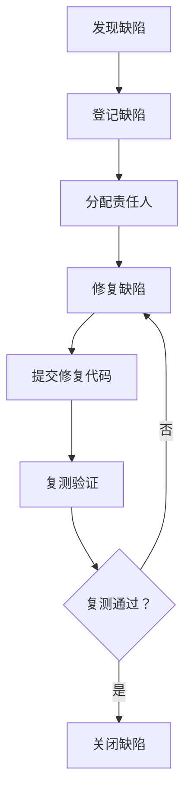

# CRM全系统测试策略设计文档

**文档编号**：CRMTST-STR-001  
**版本**：V1.0  
**编制人**：安炳琨（质量专员）  
**编制日期**：2026-07-14  
**适用范围**：MIT-FMP / mitedtsm CRM 全系统开发冲刺

---

## 1.1 测试金字塔策略

### 1.1.1 现有测试代码分布统计

通过对工作区代码搜索，项目现有测试代码分布如下：

| 测试类型 | 数量 | 分布模块 | 说明 |
|---------|------|---------|------|
| 单元测试 | 约150+ | mitedtsm-module-system（28个）、mitedtsm-module-member（6个）、mitedtsm-module-mall（25个）、mitedtsm-module-iot（15个）、mitedtsm-module-bpm（18个）、mitedtsm-module-pay（10个）、mitedtsm-module-infra（15个）、mitedtsm-module-report（2个）、mitedtsm-module-ai（30个） | 主要覆盖系统、会员、商城、IoT、BPM、支付等模块的Service层 |
| 集成测试 | 约20个 | mitedtsm-module-iot（协议集成）、mitedtsm-module-pay（支付客户端）、mitedtsm-module-bpm（流程集成） | 主要覆盖外部服务调用和协议集成 |
| API自动化测试 | 0个 | - | 暂无CRM相关API自动化测试脚本 |
| UI/E2E测试 | 0个 | - | 暂无Playwright或其他UI自动化测试脚本 |

**关键发现**：
- CRM模块（mitedtsm-module-crm）**暂无任何测试代码**
- 项目整体缺少API和UI自动化测试
- 单元测试主要集中在基础模块（system、mall、iot），业务模块覆盖不足

### 1.1.2 本阶段推荐测试分层比例

| 测试层级 | 推荐占比 | 理由 |
|---------|---------|------|
| 单元测试 | 40% | 基础模块已有一定单元测试覆盖，CRM模块需从零开始建设；新增/修改代码必须配套单元测试 |
| 接口测试 | 30% | CRM主链（线索→客户→商机→合同→回款）依赖大量API交互，接口测试是质量保障核心 |
| UI自动化测试 | 15% | 覆盖核心业务流程（创建商机、推进阶段、合同审批、回款登记），确保回归稳定性 |
| 手工功能测试 | 15% | 覆盖复杂交互、权限验证、异常场景和边界条件 |

**测试金字塔结构图**：

---

## 1.2 测试阶段划分

结合《15-全CRM差异补齐任务分工与Git协同开发计划》中的阶段定义（S0-S7），测试活动划分如下：

| 阶段编号 | 阶段名称 | 对应测试类型 | 执行人 | 通过标准 |
|---------|---------|-------------|--------|---------|
| S0 | 基线核验 | 代码核验、数据库核验、文档核验 | 曾皓冲、李祖豪、安炳琨 | 每个模块有GAP、负责人、类型、复用证据和验收标准 |
| S1 | AISDD设计 | 测试设计评审、测试用例设计 | 安炳琨、李祖豪 | 设计评审通过，测试用例覆盖P0功能点≥80% |
| S2 | 第一批并行开发 | 单元测试、开发者自测 | 各开发者 | 单元测试通过；自测记录完整；改动清单明确 |
| S3 | 主链开发 | 单元测试、接口测试、开发者自测 | 各开发者 | 主链API可联调；关键业务规则单测通过 |
| S4 | 统计与回归准备 | 集成测试准备、自动化测试脚本开发 | 安炳琨 | P0模块自测完成；自动化脚本框架搭建完成 |
| S5 | 组内交叉测试 | 接口测试、功能测试、权限测试、异常测试 | 指定交叉测试人 | 交叉测试记录完整；无P0/P1缺陷 |
| S6 | 容器部署与组间测试 | 系统测试、性能冒烟测试、安全扫描 | 安炳琨、测试组 | 所有必需组件容器化启动；组间测试通过 |
| S7 | UAT与交付 | UAT测试、回归测试、覆盖率统计 | 王文渊、安炳琨、姚昱竹 | 无阻断/严重缺陷；功能测试覆盖率≥70%；UAT结论签署 |

---

## 1.3 测试环境策略

### 1.3.1 现有环境配置

项目现有4套环境配置文件：

| 环境 | 配置文件 | 用途 |
|------|---------|------|
| local | `application-local.yaml` | 本地开发环境 |
| dev | `application-dev.yaml` | 开发环境 |
| docker | `application-docker.yaml` | Docker容器环境 |
| default | `application.yaml` | 默认配置（基础配置） |

### 1.3.2 Docker Compose环境拓扑

根据 `docker-compose/docker-compose.yml`，容器化环境包含：

| 组件 | 端口 | 用途 | 测试验证点 |
|------|------|------|-----------|
| MySQL | 3306 | 数据库 | 验证初始化、数据持久化、测试数据可导入 |
| Redis | 6379 | 缓存 | 验证服务健康和CRM缓存相关功能 |
| RabbitMQ | 5672 | 消息队列 | 验证审批/通知等实际使用场景的连通性 |
| TDengine | 6041 | 时序数据库 | 核验本期CRM是否依赖 |
| init-service | - | 初始化服务 | 验证初始化顺序、基础数据和迁移结果 |
| server | 8080 | 后端服务 | 验证CRM API、数据库连接、日志和健康状态 |
| web | 80 | 管理端Web | 验证CRM前端页面、接口代理和关键用户操作 |
| mall | - | 商城前端 | 核验编排完整性 |

### 1.3.3 环境切换策略

**切换规则**：
1. 开发阶段使用 `local` 环境，手动启动调试
2. 交叉测试阶段使用 `dev` 环境，拉取对方功能分支
3. 集成测试和UAT阶段使用 `docker` 环境，完整容器化部署
4. 最终交付使用生产环境（教师机）

---

## 1.4 缺陷管理流程

### 1.4.1 缺陷生命周期

### 1.4.2 缺陷严重级别定义

| 级别 | 定义 | 响应时限 | 修复时限 | 处理规则 |
|------|------|---------|---------|---------|
| P0 | 阻断性缺陷：系统无法启动、核心主链无法运行、数据丢失 | 1小时内响应 | 4小时内修复 | 立即停止其他工作，优先修复 |
| P1 | 严重缺陷：关键功能失效、数据不一致、安全漏洞 | 4小时内响应 | 12小时内修复 | 优先修复，不阻碍其他功能开发 |
| P2 | 一般缺陷：功能异常但不影响主流程、UI显示问题、轻微性能问题 | 1天内响应 | 3天内修复 | 按计划修复，可排期处理 |
| P3 | 建议性问题：用户体验优化、文档问题、非核心功能改进 | 3天内响应 | 下个迭代 | 记录跟踪，视资源情况处理 |

### 1.4.3 缺陷报告模板

| 字段 | 说明 | 示例 |
|------|------|------|
| BugID | 缺陷编号 | DEF-001 |
| 标题 | 缺陷简要描述 | 商机阶段无法从"谈判"推进到"赢单" |
| 严重级别 | P0/P1/P2/P3 | P1 |
| 模块 | 所属模块 | CRM-商机管理 |
| 功能分支 | 关联的Git分支 | feature/opportunity |
| 提交号 | Git提交哈希 | 7a3b2c1d |
| 环境 | 测试环境 | local/docker |
| 测试账号 | 测试使用的账号 | admin/123456 |
| 复现步骤 | 详细操作步骤 | 1. 登录系统；2. 进入商机列表；3. 选择ID为xxx的商机；4. 点击"推进阶段"；5. 选择"赢单"；6. 点击确定 |
| 预期结果 | 期望的正常结果 | 商机阶段成功推进到"赢单"状态 |
| 实际结果 | 实际发生的结果 | 页面无响应，控制台报400错误 |
| 附件 | 截图/日志/请求响应 | 截图1.png、request.log |
| 状态 | 缺陷当前状态 | 待修复/修复中/待复测/已关闭/已拒绝 |
| 指派人 | 负责修复的人员 | 黄金戈 |

---

## 1.5 质量门禁（准入准出标准）

### 1.5.1 提测准入标准

开发人员将代码提交测试前，必须满足以下条件：

| 编号 | 准入条件 | 验证方式 |
|------|---------|---------|
| GATE-IN-01 | 代码已提交到功能分支并推送至远程仓库 | 检查Git提交记录 |
| GATE-IN-02 | 本次新增/修改的核心规则具备单元测试 | 检查测试代码和运行结果 |
| GATE-IN-03 | 开发者自测记录完整（正常、异常、权限、边界） | 检查自测记录文档 |
| GATE-IN-04 | 对应GAP、User Story和验收标准已明确 | 检查需求追踪矩阵 |
| GATE-IN-05 | 数据库变更已写入`database/new`增量SQL | 检查SQL文件 |
| GATE-IN-06 | 无P0级缺陷阻塞 | 检查缺陷清单 |

### 1.5.2 版本准出标准

版本进入UAT或发布前，必须满足以下条件：

| 编号 | 准出条件 | 验证方式 |
|------|---------|---------|
| GATE-OUT-01 | 功能测试覆盖率 ≥ 70%（已执行并有结果的确认功能点 ÷ 确认功能点总数） | 姚昱竹、安炳琨统计 |
| GATE-OUT-02 | 无P0级缺陷 | 检查缺陷清单 |
| GATE-OUT-03 | P1级缺陷 ≤ 2个且已有修复计划 | 检查缺陷清单 |
| GATE-OUT-04 | 核心主链（线索→客户→商机→合同→回款）端到端测试通过 | 检查集成测试报告 |
| GATE-OUT-05 | 交叉测试记录完整 | 检查CT-01~CT-07记录 |
| GATE-OUT-06 | Docker Compose完整部署成功 | 检查容器状态 |
| GATE-OUT-07 | UAT核心场景通过，项目经理完成最终验收结论 | 检查UAT记录 |

---

## 1.6 测试数据策略

### 1.6.1 数据来源

| 来源类型 | 适用场景 | 说明 |
|---------|---------|------|
| 手工构造 | 基础数据（租户、部门、角色、用户） | 通过SQL脚本或管理后台手动创建 |
| AI生成 | 业务数据（客户、联系人、商机、合同） | 使用AI工具批量生成符合业务规则的测试数据 |
| 生产脱敏 | 真实业务数据 | 从生产环境导出并脱敏，用于性能测试和真实场景验证 |

### 1.6.2 数据量级

| 数据类别 | 数量 | 用途 |
|---------|------|------|
| 租户/部门/角色/用户 | 5-10个 | 验证权限和数据范围 |
| 客户/联系人/线索 | 100+个 | 覆盖正常、重复、无效、公海等场景 |
| 产品/商机/报价/跟进 | 50+个 | 覆盖阶段、输单、金额、关联等场景 |
| 合同/订单/审批 | 30+个 | 覆盖提交、驳回、撤回、通过等场景 |
| 回款/回款计划 | 30+个 | 覆盖正常、部分、超额、逾期等场景 |

### 1.6.3 脱敏规则

| 字段类型 | 脱敏方式 | 示例 |
|---------|---------|------|
| 手机号 | 中间4位替换为* | 138****8888 |
| 邮箱 | @前字符替换为* | ****@example.com |
| 姓名 | 姓氏保留，名字替换为* | 张** |
| 身份证号 | 中间8位替换为* | 110101********1234 |
| 地址 | 详细地址替换为* | 北京市朝阳区*** |

---

## 附录：关键代码搜索证据清单

| 证据类别 | 文件路径 | 说明 |
|---------|---------|------|
| 单元测试分布 | `Server/mitedtsm-module-system/src/test/java/` | 系统模块单元测试（28个） |
| 单元测试分布 | `Server/mitedtsm-module-member/src/test/java/` | 会员模块单元测试（6个） |
| 单元测试分布 | `Server/mitedtsm-module-mall/` | 商城模块单元测试（25个） |
| 单元测试分布 | `Server/mitedtsm-module-bpm/src/test/java/` | BPM模块单元测试（18个） |
| 单元测试分布 | `Server/mitedtsm-module-iot/` | IoT模块单元测试（15个） |
| 环境配置 | `Server/mitedtsm-server/src/main/resources/application.yaml` | 默认配置 |
| 环境配置 | `Server/mitedtsm-server/src/main/resources/application-local.yaml` | 本地配置 |
| 环境配置 | `Server/mitedtsm-server/src/main/resources/application-dev.yaml` | 开发配置 |
| 环境配置 | `Server/mitedtsm-server/src/main/resources/application-docker.yaml` | Docker配置 |
| Docker编排 | `docker-compose/docker-compose.yml` | 完整容器编排配置 |
| 开发计划 | `15-全CRM差异补齐任务分工与Git协同开发计划 (1).md` | 阶段定义和测试要求 |

---

**文档版本记录**

| 版本 | 日期 | 修改人 | 修改内容 |
|------|------|--------|---------|
| V1.0 | 2026-07-14 | 安炳琨 | 初始版本，包含全部6个子任务 |