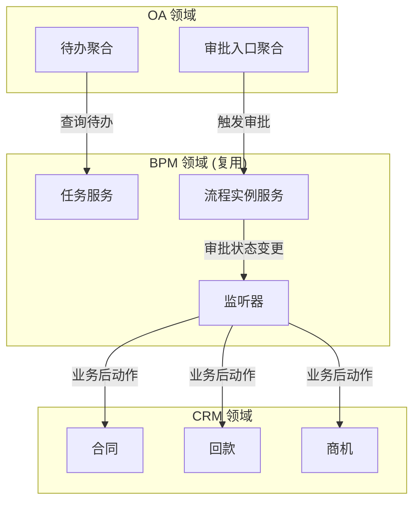
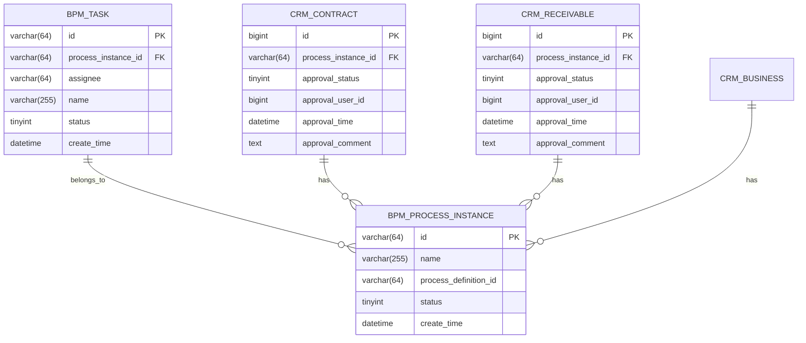
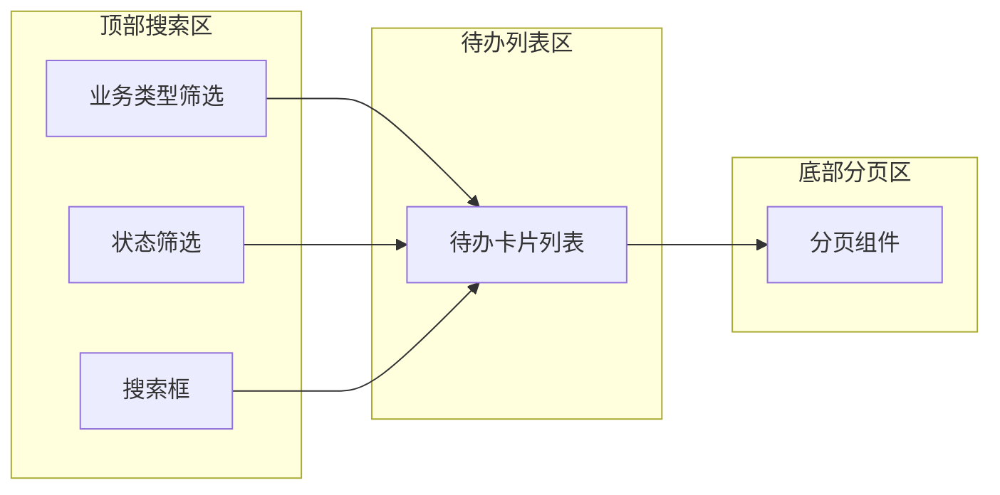
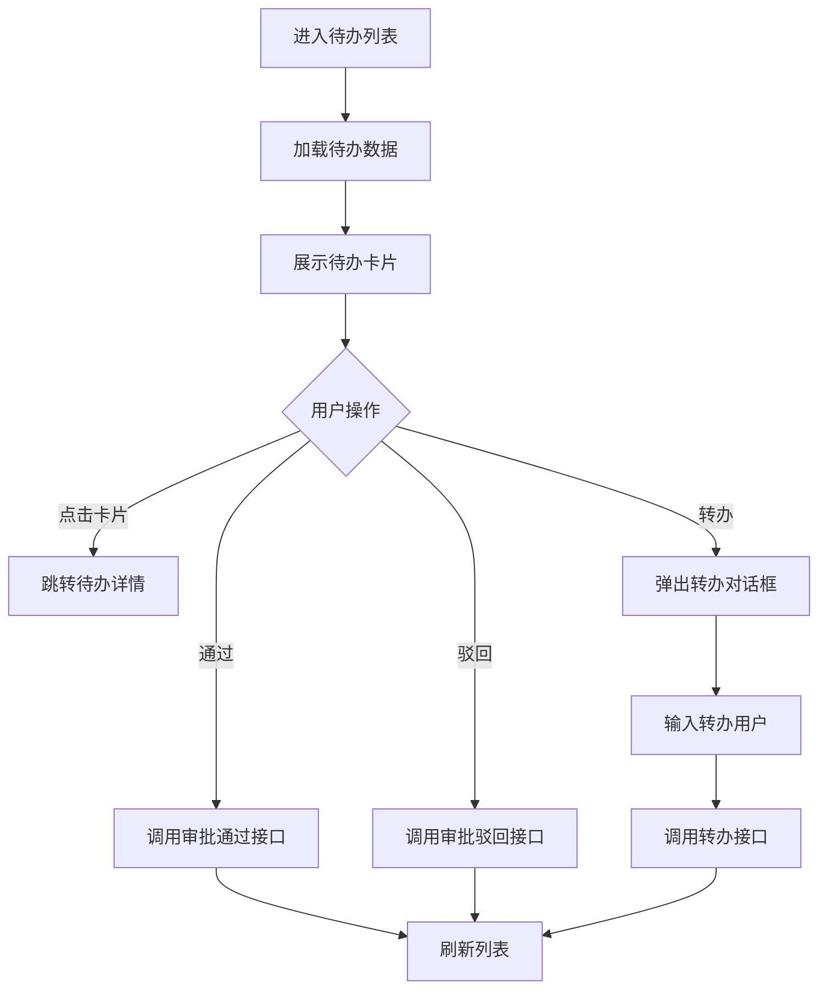
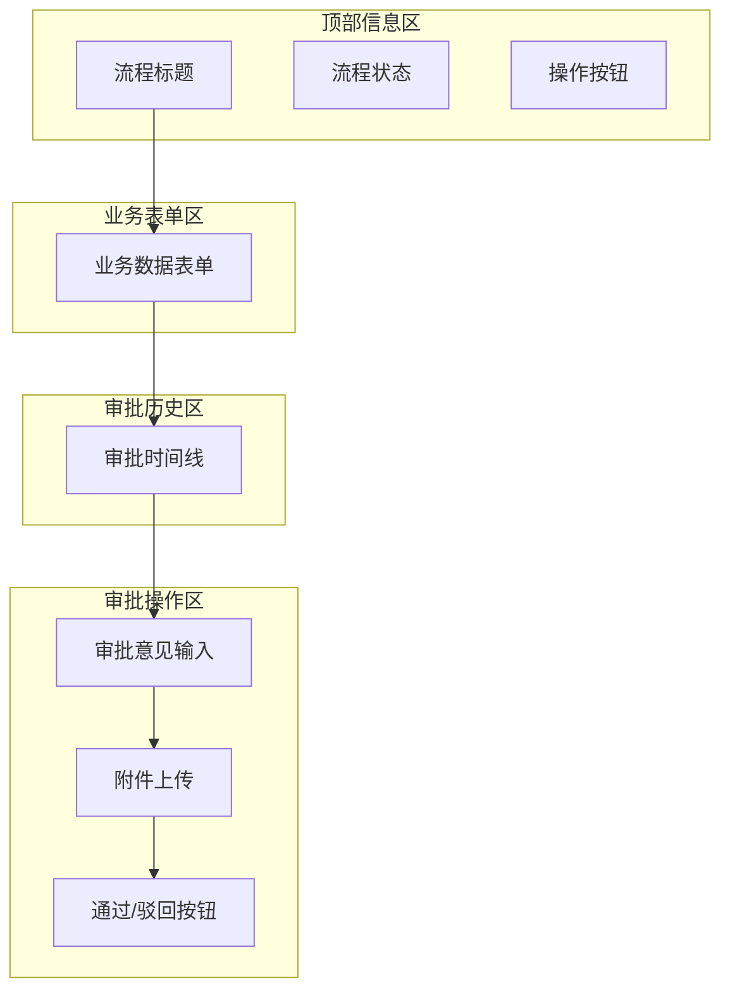
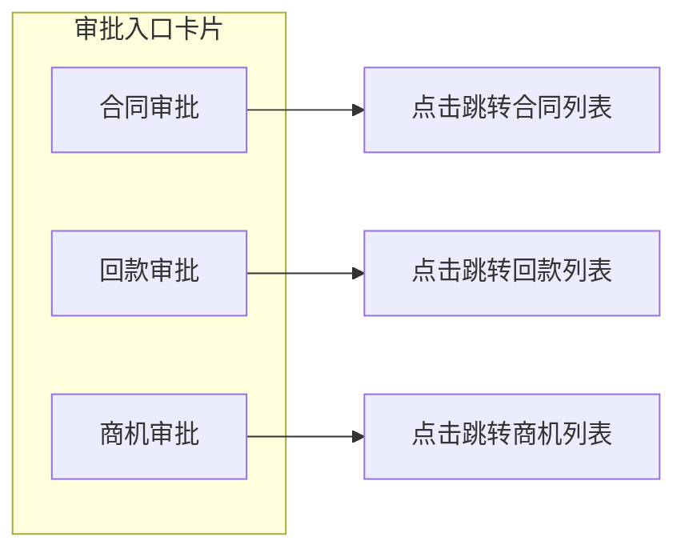

# AISDD 详细设计文档 - OA 待办与审批入口联动

## 1. 概述

### 1.1 设计目标

基于现有 BPM（Flowable）能力，实现 CRM 待办与业务审批入口的联动，复用已有审批引擎，仅做最小范围的前后端/配置改动。

### 1.2 需求来源

| GAP ID | 需求描述 | 类型 | 优先级 |
|--------|----------|------|--------|
| GAP-010 | 统一审批中心 - 复用 BPM 待办/流程；实现业务后动作 | 改进 | P0 |
| GAP-011 | 公告、消息、附件、导入导出、日志 - 复用公共能力 | 复用/扩展 | P0 |

### 1.3 任务分工

| 项目 | 内容 |
|------|------|
| 负责人 | 王文渊 |
| 主开发包 | PKG-04（CRM 协同与配置） |
| 开发任务 | 补齐 CRM 待办与业务审批入口的联动 |

---

## 2. 领域模型设计

### 2.1 领域边界



### 2.2 核心聚合

#### 2.2.1 待办聚合 (Todo)

| 职责 | 说明 |
|------|------|
| 查询当前用户的所有待办任务 | 聚合 BPM 任务、CRM 待办 |
| 待办状态管理 | 待处理、已完成、已过期 |
| 待办跳转 | 跳转到对应业务页面 |
| 待办优先级 | 高、中、低 |

#### 2.2.2 审批入口聚合 (Approval)

| 职责 | 说明 |
|------|------|
| 发起审批 | 创建流程实例并关联业务数据 |
| 审批操作 | 通过、驳回、转办、撤回 |
| 审批状态同步 | 审批完成后同步业务状态 |
| 审批意见记录 | 记录审批意见和附件 |

### 2.3 领域事件

| 事件 | 触发时机 | 消费者 |
|------|----------|--------|
| `CrmContractSubmitted` | 合同提交审批 | BPM 流程启动 |
| `CrmReceivableSubmitted` | 回款提交审批 | BPM 流程启动 |
| `BpmProcessApproved` | 审批通过 | CRM 状态更新 |
| `BpmProcessRejected` | 审批驳回 | CRM 状态回滚 |
| `BpmTaskCreated` | 待办任务创建 | 待办通知 |

---

## 3. 数据模型设计

### 3.1 现有模型复用

| 表名 | 领域 | 复用方式 |
|------|------|----------|
| `bpm_task` | BPM | 直接复用，查询待办任务 |
| `bpm_process_instance` | BPM | 直接复用，查询流程实例 |
| `crm_contract` | CRM | 扩展审批状态字段 |
| `crm_receivable` | CRM | 扩展审批状态字段 |
| `crm_business` | CRM | 扩展审批状态字段 |

### 3.2 新增/扩展字段

#### 3.2.1 `crm_contract` 扩展字段

| 字段名 | 类型 | 说明 | 约束 |
|--------|------|------|------|
| `approval_status` | TINYINT | 审批状态：0-待提交 1-审批中 2-通过 3-驳回 | NOT NULL DEFAULT 0 |
| `process_instance_id` | VARCHAR(64) | BPM 流程实例ID | NULL |
| `approval_user_id` | BIGINT | 审批人ID | NULL |
| `approval_time` | DATETIME | 审批时间 | NULL |
| `approval_comment` | TEXT | 审批意见 | NULL |

#### 3.2.2 `crm_receivable` 扩展字段

| 字段名 | 类型 | 说明 | 约束 |
|--------|------|------|------|
| `approval_status` | TINYINT | 审批状态：0-待提交 1-审批中 2-通过 3-驳回 | NOT NULL DEFAULT 0 |
| `process_instance_id` | VARCHAR(64) | BPM 流程实例ID | NULL |
| `approval_user_id` | BIGINT | 审批人ID | NULL |
| `approval_time` | DATETIME | 审批时间 | NULL |
| `approval_comment` | TEXT | 审批意见 | NULL |

### 3.3 枚举定义

#### 3.3.1 CrmApprovalStatusEnum

| 枚举值 | 名称 | 说明 |
|--------|------|------|
| 0 | PENDING | 待提交 |
| 1 | APPROVING | 审批中 |
| 2 | APPROVED | 已通过 |
| 3 | REJECTED | 已驳回 |

### 3.4 数据模型关系图



---

## 4. API 接口设计

### 4.1 待办任务接口

#### 4.1.1 查询待办列表

| 属性 | 值 |
|------|-----|
| **路径** | `/api/admin/oa/todo/page` |
| **方法** | GET |
| **权限** | `oa:todo:query` |

请求参数：

| 参数名 | 类型 | 必填 | 说明 |
|--------|------|------|------|
| pageNo | Integer | 否 | 页码，默认1 |
| pageSize | Integer | 否 | 每页数量，默认10 |
| status | Integer | 否 | 待办状态：0-全部 1-待处理 2-已过期 |
| bizType | String | 否 | 业务类型：contract/receivable/business |

响应结构：

```json
{
  "code": 0,
  "msg": "success",
  "data": {
    "list": [
      {
        "id": "string",
        "taskId": "string",
        "processInstanceId": "string",
        "processDefinitionId": "string",
        "processName": "string",
        "taskName": "string",
        "bizType": "string",
        "bizId": "number",
        "bizTitle": "string",
        "priority": "string",
        "status": "number",
        "assignee": "string",
        "createTime": "string",
        "dueDate": "string",
        "expired": "boolean",
        "jumpUrl": "string"
      }
    ],
    "total": 100,
    "pageNo": 1,
    "pageSize": 10
  }
}
```

#### 4.1.2 查询待办详情

| 属性 | 值 |
|------|-----|
| **路径** | `/api/admin/oa/todo/{id}` |
| **方法** | GET |
| **权限** | `oa:todo:query` |

响应结构：

```json
{
  "code": 0,
  "msg": "success",
  "data": {
    "id": "string",
    "taskId": "string",
    "processInstanceId": "string",
    "processDefinitionId": "string",
    "processName": "string",
    "taskName": "string",
    "bizType": "string",
    "bizId": "number",
    "bizTitle": "string",
    "priority": "string",
    "status": "number",
    "assignee": "string",
    "createTime": "string",
    "dueDate": "string",
    "expired": "boolean",
    "jumpUrl": "string",
    "formData": {},
    "history": []
  }
}
```

#### 4.1.3 审批通过

| 属性 | 值 |
|------|-----|
| **路径** | `/api/admin/oa/todo/{id}/approve` |
| **方法** | POST |
| **权限** | `oa:todo:approve` |

请求参数：

| 参数名 | 类型 | 必填 | 说明 |
|--------|------|------|------|
| comment | String | 否 | 审批意见 |
| nextAssignee | String | 否 | 下一审批人 |

响应结构：

```json
{
  "code": 0,
  "msg": "success",
  "data": {
    "taskId": "string",
    "status": "APPROVED",
    "nextTaskId": "string"
  }
}
```

#### 4.1.4 审批驳回

| 属性 | 值 |
|------|-----|
| **路径** | `/api/admin/oa/todo/{id}/reject` |
| **方法** | POST |
| **权限** | `oa:todo:approve` |

请求参数：

| 参数名 | 类型 | 必填 | 说明 |
|--------|------|------|------|
| comment | String | 是 | 驳回意见 |

响应结构：

```json
{
  "code": 0,
  "msg": "success",
  "data": {
    "taskId": "string",
    "status": "REJECTED"
  }
}
```

#### 4.1.5 转办任务

| 属性 | 值 |
|------|-----|
| **路径** | `/api/admin/oa/todo/{id}/transfer` |
| **方法** | POST |
| **权限** | `oa:todo:transfer` |

请求参数：

| 参数名 | 类型 | 必填 | 说明 |
|--------|------|------|------|
| userId | String | 是 | 转办用户ID |
| comment | String | 否 | 转办意见 |

响应结构：

```json
{
  "code": 0,
  "msg": "success",
  "data": {
    "taskId": "string",
    "assignee": "string"
  }
}
```

### 4.2 审批入口接口

#### 4.2.1 提交合同审批

| 属性 | 值 |
|------|-----|
| **路径** | `/api/admin/oa/approval/contract/submit` |
| **方法** | POST |
| **权限** | `crm:contract:approve` |

请求参数：

| 参数名 | 类型 | 必填 | 说明 |
|--------|------|------|------|
| contractId | Long | 是 | 合同ID |
| processDefinitionKey | String | 是 | 流程定义Key |

响应结构：

```json
{
  "code": 0,
  "msg": "success",
  "data": {
    "contractId": "number",
    "processInstanceId": "string",
    "approvalStatus": 1
  }
}
```

#### 4.2.2 提交回款审批

| 属性 | 值 |
|------|-----|
| **路径** | `/api/admin/oa/approval/receivable/submit` |
| **方法** | POST |
| **权限** | `crm:receivable:approve` |

请求参数：

| 参数名 | 类型 | 必填 | 说明 |
|--------|------|------|------|
| receivableId | Long | 是 | 回款ID |
| processDefinitionKey | String | 是 | 流程定义Key |

响应结构：

```json
{
  "code": 0,
  "msg": "success",
  "data": {
    "receivableId": "number",
    "processInstanceId": "string",
    "approvalStatus": 1
  }
}
```

#### 4.2.3 撤回审批

| 属性 | 值 |
|------|-----|
| **路径** | `/api/admin/oa/approval/{processInstanceId}/withdraw` |
| **方法** | POST |
| **权限** | `oa:approval:withdraw` |

请求参数：

| 参数名 | 类型 | 必填 | 说明 |
|--------|------|------|------|
| comment | String | 否 | 撤回原因 |

响应结构：

```json
{
  "code": 0,
  "msg": "success",
  "data": {
    "processInstanceId": "string",
    "status": "CANCELLED"
  }
}
```

---

## 5. 页面与交互设计

### 5.1 页面结构

```
Web/src/views/oa/
├── todo/
│   ├── index.vue          # 待办列表页
│   └── detail.vue         # 待办详情/审批页
└── approval/
    └── index.vue          # 审批入口汇总页
```

### 5.2 待办列表页 (todo/index.vue)

#### 5.2.1 页面布局



#### 5.2.2 待办卡片

| 字段 | 说明 | 交互 |
|------|------|------|
| 标题 | 业务名称+编号 | 点击跳转详情 |
| 业务类型 | 合同/回款/商机 | 标签展示 |
| 优先级 | 高/中/低 | 颜色区分 |
| 待办时间 | 创建时间 | 显示 |
| 截止时间 | 到期时间 | 过期红色标红 |
| 操作按钮 | 通过/驳回/转办 | 按钮组 |

#### 5.2.3 交互流程



### 5.3 待办详情/审批页 (todo/detail.vue)

#### 5.3.1 页面布局



#### 5.3.2 审批历史时间线

| 字段 | 说明 |
|------|------|
| 审批节点 | 节点名称 |
| 审批人 | 用户姓名 |
| 审批意见 | 意见内容 |
| 审批时间 | 操作时间 |
| 审批结果 | 通过/驳回 |

### 5.4 审批入口汇总页 (approval/index.vue)

#### 5.4.1 页面布局



---

## 6. 权限设计

### 6.1 权限点定义

| 权限编码 | 权限名称 | 说明 | 归属模块 |
|----------|----------|------|----------|
| `oa:todo:query` | 待办查询 | 查询个人待办列表 | OA |
| `oa:todo:approve` | 待办审批 | 通过/驳回待办 | OA |
| `oa:todo:transfer` | 待办转办 | 转办待办任务 | OA |
| `oa:todo:detail` | 待办详情 | 查看待办详情 | OA |
| `oa:approval:submit` | 提交审批 | 提交业务审批 | OA |
| `oa:approval:withdraw` | 撤回审批 | 撤回已提交审批 | OA |
| `crm:contract:approve` | 合同审批 | 合同提交审批 | CRM |
| `crm:receivable:approve` | 回款审批 | 回款提交审批 | CRM |

### 6.2 角色权限映射

| 角色 | 权限点 |
|------|--------|
| 系统管理员 | 所有权限 |
| 销售经理 | `oa:todo:query`, `oa:todo:approve`, `oa:todo:detail`, `crm:contract:approve`, `crm:receivable:approve` |
| 销售代表 | `oa:todo:query`, `oa:todo:detail`, `oa:approval:submit`, `oa:approval:withdraw`, `crm:contract:approve`, `crm:receivable:approve` |
| 财务专员 | `oa:todo:query`, `oa:todo:approve`, `oa:todo:detail`, `crm:receivable:approve` |

### 6.3 数据权限

| 业务类型 | 数据范围 | 说明 |
|----------|----------|------|
| 待办任务 | 本人待办 | 只能看到分配给自己的待办 |
| 审批记录 | 本人参与的审批 | 只能看到自己审批过或待审批的记录 |
| 合同审批 | 本部门合同 | 部门负责人可审批本部门合同 |
| 回款审批 | 本部门回款 | 部门负责人可审批本部门回款 |

---

## 7. 测试设计

### 7.1 测试用例

#### 7.1.1 待办查询测试

| 用例编号 | 测试场景 | 前置条件 | 操作步骤 | 预期结果 | 优先级 |
|----------|----------|----------|----------|----------|--------|
| TC-OA-001 | 查询全部待办 | 存在待办任务 | 进入待办列表页 | 显示所有待办 | P0 |
| TC-OA-002 | 按业务类型筛选 | 存在不同类型待办 | 选择业务类型筛选 | 只显示对应类型待办 | P0 |
| TC-OA-003 | 按状态筛选 | 存在不同状态待办 | 选择状态筛选 | 只显示对应状态待办 | P0 |
| TC-OA-004 | 搜索待办 | 存在匹配待办 | 输入关键词搜索 | 显示匹配结果 | P1 |
| TC-OA-005 | 待办为空 | 无待办任务 | 进入待办列表页 | 显示空态提示 | P1 |

#### 7.1.2 审批操作测试

| 用例编号 | 测试场景 | 前置条件 | 操作步骤 | 预期结果 | 优先级 |
|----------|----------|----------|----------|----------|--------|
| TC-OA-006 | 审批通过 | 有待审批任务 | 点击通过按钮 | 任务状态变为已通过，下一节点产生新待办 | P0 |
| TC-OA-007 | 审批驳回 | 有待审批任务 | 点击驳回按钮，输入意见 | 任务状态变为已驳回，流程结束 | P0 |
| TC-OA-008 | 转办任务 | 有待审批任务 | 点击转办按钮，选择用户 | 任务分配给新用户，原用户不再看到 | P1 |
| TC-OA-009 | 审批意见为空 | 有待审批任务 | 点击通过按钮，不输入意见 | 审批成功，意见为空 | P1 |
| TC-OA-010 | 重复审批 | 有已审批任务 | 再次尝试审批 | 提示任务已处理 | P0 |

#### 7.1.3 审批入口测试

| 用例编号 | 测试场景 | 前置条件 | 操作步骤 | 预期结果 | 优先级 |
|----------|----------|----------|----------|----------|--------|
| TC-OA-011 | 提交合同审批 | 存在待提交合同 | 点击提交审批 | 合同状态变为审批中，产生待办任务 | P0 |
| TC-OA-012 | 提交回款审批 | 存在待提交回款 | 点击提交审批 | 回款状态变为审批中，产生待办任务 | P0 |
| TC-OA-013 | 撤回审批 | 存在审批中流程 | 点击撤回按钮 | 流程终止，业务状态回滚 | P1 |
| TC-OA-014 | 审批通过后业务状态更新 | 审批通过 | 查看业务记录 | 业务状态变为已审批 | P0 |
| TC-OA-015 | 审批驳回后业务状态更新 | 审批驳回 | 查看业务记录 | 业务状态变为已驳回 | P0 |

#### 7.1.4 权限测试

| 用例编号 | 测试场景 | 前置条件 | 操作步骤 | 预期结果 | 优先级 |
|----------|----------|----------|----------|----------|--------|
| TC-OA-016 | 无权限查看待办 | 无待办权限 | 尝试访问待办页面 | 提示无权限 | P0 |
| TC-OA-017 | 无权限审批 | 无审批权限 | 尝试审批 | 提示无权限 | P0 |
| TC-OA-018 | 查看他人待办 | 有查询权限 | 尝试查看他人待办 | 无法看到他人待办 | P0 |
| TC-OA-019 | 部门数据范围 | 部门负责人 | 查看待办 | 只能看到本部门业务待办 | P1 |

### 7.2 自动化测试

| 测试类型 | 范围 | 工具 |
|----------|------|------|
| 接口自动化 | 待办查询、审批操作接口 | Postman/Java Unit Test |
| 前端自动化 | 待办列表页、审批页核心交互 | Cypress |

---

## 8. 菜单与国际化

### 8.1 菜单配置

| 菜单名称 | 路径 | 图标 | 父菜单 | 权限标识 |
|----------|------|------|--------|----------|
| OA 待办 | `/oa/todo` | `List` | 无 | `oa:todo:query` |
| 审批入口 | `/oa/approval` | `Process` | 无 | `oa:approval:submit` |

### 8.2 国际化配置

#### 中文配置 (zh-CN)

```json
{
  "oa": {
    "todo": {
      "title": "OA 待办",
      "pageTitle": "待办列表",
      "businessType": "业务类型",
      "status": "状态",
      "priority": "优先级",
      "createTime": "创建时间",
      "dueDate": "截止时间",
      "approve": "通过",
      "reject": "驳回",
      "transfer": "转办",
      "detail": "详情",
      "noData": "暂无待办任务",
      "expired": "已过期",
      "contract": "合同审批",
      "receivable": "回款审批",
      "business": "商机审批"
    },
    "approval": {
      "title": "审批入口",
      "pageTitle": "审批汇总",
      "submit": "提交审批",
      "withdraw": "撤回审批",
      "contract": "合同审批",
      "receivable": "回款审批",
      "business": "商机审批"
    }
  }
}
```

#### 英文配置 (en)

```json
{
  "oa": {
    "todo": {
      "title": "OA Todo",
      "pageTitle": "Todo List",
      "businessType": "Business Type",
      "status": "Status",
      "priority": "Priority",
      "createTime": "Create Time",
      "dueDate": "Due Date",
      "approve": "Approve",
      "reject": "Reject",
      "transfer": "Transfer",
      "detail": "Detail",
      "noData": "No todo tasks",
      "expired": "Expired",
      "contract": "Contract Approval",
      "receivable": "Receivable Approval",
      "business": "Business Approval"
    },
    "approval": {
      "title": "Approval",
      "pageTitle": "Approval Summary",
      "submit": "Submit Approval",
      "withdraw": "Withdraw",
      "contract": "Contract Approval",
      "receivable": "Receivable Approval",
      "business": "Business Approval"
    }
  }
}
```

---

## 9. SQL 迁移脚本

### 9.1 扩展合同表字段

```sql
ALTER TABLE `crm_contract`
ADD COLUMN `approval_status` TINYINT DEFAULT 0 COMMENT '审批状态：0-待提交 1-审批中 2-通过 3-驳回' AFTER `status`,
ADD COLUMN `process_instance_id` VARCHAR(64) DEFAULT NULL COMMENT 'BPM流程实例ID' AFTER `approval_status`,
ADD COLUMN `approval_user_id` BIGINT DEFAULT NULL COMMENT '审批人ID' AFTER `process_instance_id`,
ADD COLUMN `approval_time` DATETIME DEFAULT NULL COMMENT '审批时间' AFTER `approval_user_id`,
ADD COLUMN `approval_comment` TEXT DEFAULT NULL COMMENT '审批意见' AFTER `approval_time`;
```

### 9.2 扩展回款表字段

```sql
ALTER TABLE `crm_receivable`
ADD COLUMN `approval_status` TINYINT DEFAULT 0 COMMENT '审批状态：0-待提交 1-审批中 2-通过 3-驳回' AFTER `status`,
ADD COLUMN `process_instance_id` VARCHAR(64) DEFAULT NULL COMMENT 'BPM流程实例ID' AFTER `approval_status`,
ADD COLUMN `approval_user_id` BIGINT DEFAULT NULL COMMENT '审批人ID' AFTER `process_instance_id`,
ADD COLUMN `approval_time` DATETIME DEFAULT NULL COMMENT '审批时间' AFTER `approval_user_id`,
ADD COLUMN `approval_comment` TEXT DEFAULT NULL COMMENT '审批意见' AFTER `approval_time`;
```

### 9.3 菜单初始化 SQL

```sql
INSERT INTO `system_menu` (`id`, `name`, `path`, `component`, `icon`, `parent_id`, `sort`, `status`, `visible`, `permission`, `create_time`, `update_time`)
VALUES
(NULL, 'OA待办', '/oa/todo', 'oa/todo/index', 'List', 0, 1, 0, 1, 'oa:todo:query', NOW(), NOW()),
(NULL, '审批入口', '/oa/approval', 'oa/approval/index', 'Process', 0, 2, 0, 1, 'oa:approval:submit', NOW(), NOW());
```

---

## 10. 改动文件清单

### 10.1 后端改动

| 文件路径 | 改动类型 | 说明 |
|----------|----------|------|
| `mitedtsm-module-bpm/src/main/java/.../BpmTaskService.java` | 扩展 | 添加待办聚合查询方法 |
| `mitedtsm-module-bpm/src/main/java/.../BpmTaskServiceImpl.java` | 扩展 | 实现待办聚合查询 |
| `mitedtsm-module-crm/src/main/java/.../CrmContractDO.java` | 扩展 | 添加审批状态相关字段 |
| `mitedtsm-module-crm/src/main/java/.../CrmReceivableDO.java` | 扩展 | 添加审批状态相关字段 |
| `mitedtsm-module-crm/src/main/java/.../CrmContractService.java` | 扩展 | 添加提交审批方法 |
| `mitedtsm-module-crm/src/main/java/.../CrmContractServiceImpl.java` | 扩展 | 实现提交审批逻辑 |
| `mitedtsm-module-crm/src/main/java/.../CrmReceivableService.java` | 扩展 | 添加提交审批方法 |
| `mitedtsm-module-crm/src/main/java/.../CrmReceivableServiceImpl.java` | 扩展 | 实现提交审批逻辑 |
| `mitedtsm-module-bpm/src/main/java/.../listener/CrmContractStatusListener.java` | 新增 | 合同审批状态监听器 |
| `mitedtsm-module-bpm/src/main/java/.../listener/CrmReceivableStatusListener.java` | 新增 | 回款审批状态监听器 |
| `mitedtsm-module-bpm/src/main/java/.../enums/CrmApprovalStatusEnum.java` | 新增 | 审批状态枚举 |

### 10.2 前端改动

| 文件路径 | 改动类型 | 说明 |
|----------|----------|------|
| `Web/src/views/oa/todo/index.vue` | 新增 | 待办列表页 |
| `Web/src/views/oa/todo/detail.vue` | 新增 | 待办详情/审批页 |
| `Web/src/views/oa/approval/index.vue` | 新增 | 审批入口汇总页 |
| `Web/src/api/oa/todo.js` | 新增 | 待办接口API |
| `Web/src/api/oa/approval.js` | 新增 | 审批接口API |
| `Web/src/locales/zh-CN/oa.js` | 新增 | 中文国际化 |
| `Web/src/locales/en/oa.js` | 新增 | 英文国际化 |

### 10.3 配置改动

| 文件路径 | 改动类型 | 说明 |
|----------|----------|------|
| `database/new/20260714-oa-todo-approval.sql` | 新增 | SQL迁移脚本 |

---

## 11. 依赖与集成

### 11.1 模块依赖

| 依赖模块 | 说明 |
|----------|------|
| `mitedtsm-module-bpm` | 复用 BPM 任务服务和流程实例服务 |
| `mitedtsm-module-crm` | 扩展合同和回款领域的审批状态 |
| `mitedtsm-module-system` | 复用菜单、权限、字典能力 |

### 11.2 集成点

| 集成点 | 方式 | 说明 |
|--------|------|------|
| BPM 待办查询 | 调用 `BpmTaskService` | 获取当前用户待办任务 |
| 流程启动 | 调用 `BpmProcessInstanceService` | 创建流程实例 |
| 审批操作 | 调用 `BpmTaskService` | 通过/驳回/转办任务 |
| 审批状态同步 | BPM 监听器 | 审批完成后更新业务状态 |
| 业务后动作 | BPM Trigger | 审批通过后触发业务逻辑 |

---

## 12. 设计评审要点

| 评审项 | 评审内容 | 通过标准 |
|--------|----------|----------|
| 领域模型 | 待办聚合、审批入口聚合的职责边界 | 职责清晰，无重复建模 |
| 数据模型 | 扩展字段合理性 | 字段必要，无冗余 |
| API 设计 | 接口完整性、参数合理性 | 覆盖所有操作场景 |
| 页面设计 | 交互流程、用户体验 | 流程清晰，操作便捷 |
| 权限设计 | 权限点定义、数据范围 | 权限合理，无越权风险 |
| 测试设计 | 测试用例覆盖率 | 覆盖所有核心场景 |
| 改动范围 | 最小改动原则 | 不重复开发，复用现有能力 |