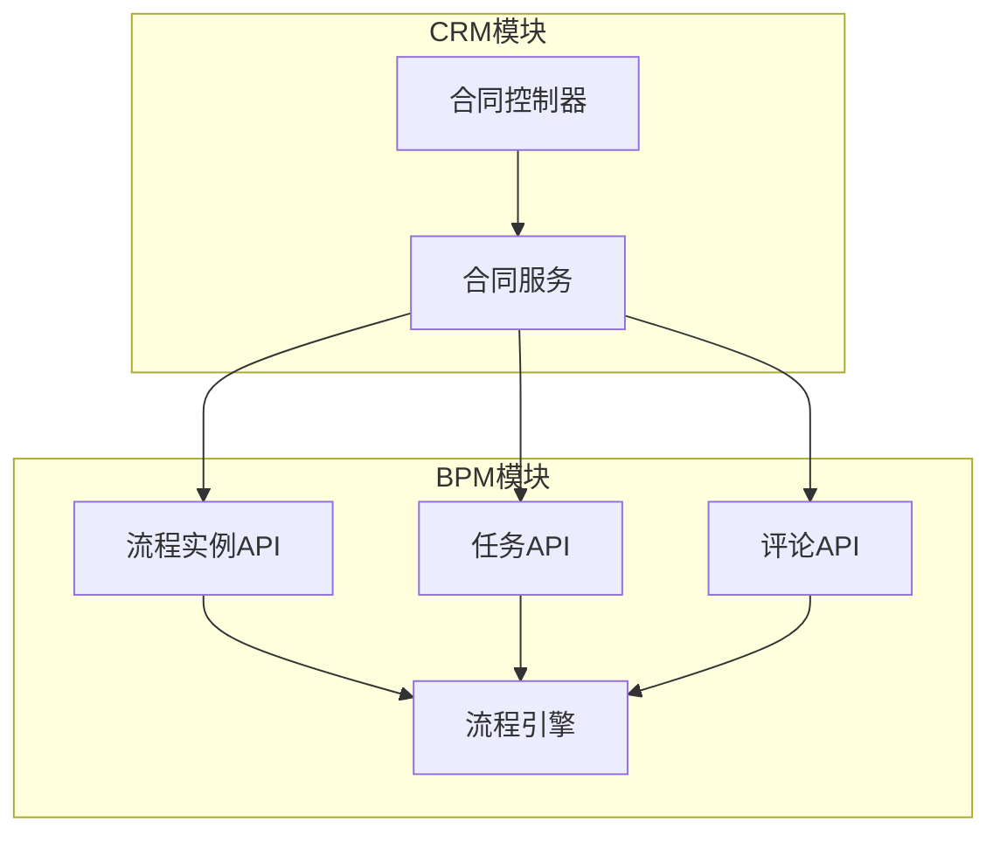
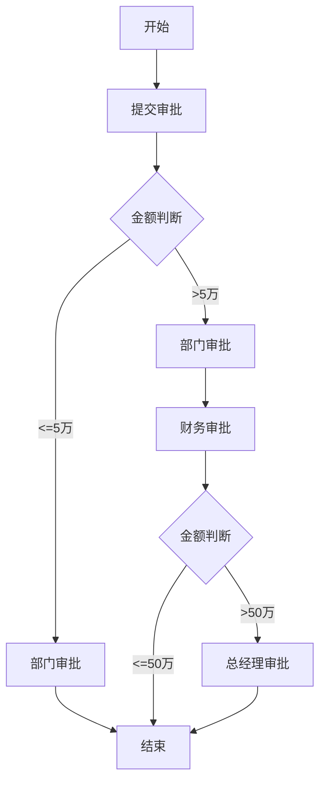
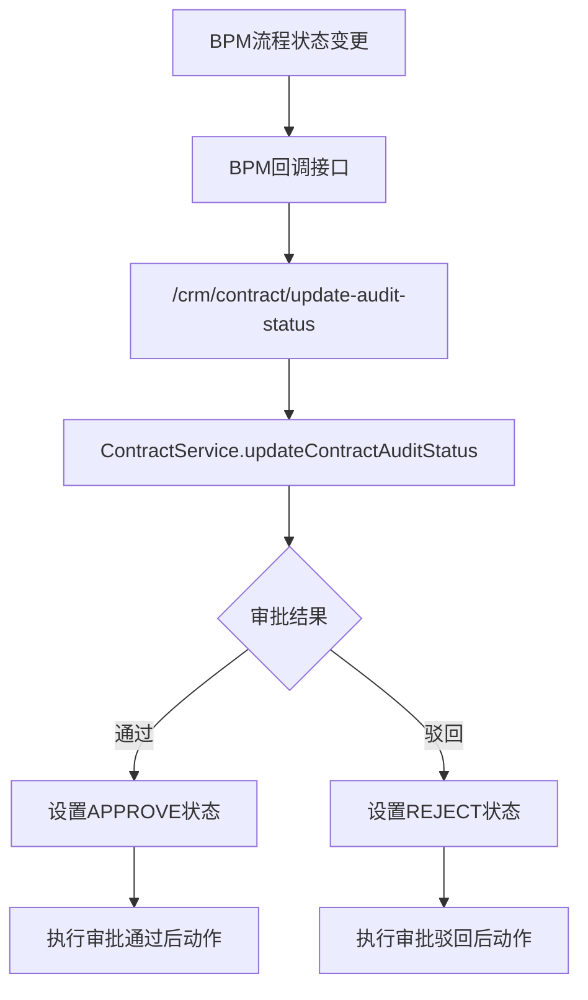

# GAP-007 阶段1：合同/订单映射与BPM审批集成 - BPM方案

> **任务来源**: 全CRM差异补齐任务分工与Git协同开发计划  
> **GAP编号**: GAP-007  
> **责任人**: 李祖豪（技术专员）  
> **设计日期**: 2026-07-14  
> **阶段**: S1 AISDD设计

---

## 一、BPM集成架构



---

## 二、流程定义设计

### 2.1 流程定义Key

| 流程Key | 流程名称 | 版本 | 说明 |
|:---|:---|:---|:---|
| `crm-contract-audit` | 合同审批流程 | 1.0 | 合同/订单审批流程 |

### 2.2 流程节点设计



### 2.3 流程节点详情

| 节点ID | 节点名称 | 类型 | 审批人 | 说明 |
|:---|:---|:---|:---|:---|
| start | 开始 | 开始节点 | - | 流程开始 |
| submit | 提交审批 | 用户任务 | 发起人 | 提交审批申请 |
| dept_audit | 部门审批 | 用户任务 | 部门负责人 | 部门负责人审批 |
| finance_audit | 财务审批 | 用户任务 | 财务人员 | 金额>5万时需财务审批 |
| gm_audit | 总经理审批 | 用户任务 | 总经理 | 金额>50万时需总经理审批 |
| end | 结束 | 结束节点 | - | 流程结束 |

---

## 三、流程变量设计

### 3.1 启动时传递变量

| 变量名 | 类型 | 必填 | 说明 |
|:---|:---|:---|:---|
| contractId | Long | 是 | 合同ID |
| contractName | String | 是 | 合同名称 |
| totalPrice | BigDecimal | 是 | 合同金额 |
| ownerUserId | Long | 是 | 负责人ID |
| customerId | Long | 否 | 客户ID |
| businessId | Long | 否 | 商机ID |

### 3.2 流程中使用的变量

| 变量名 | 类型 | 说明 |
|:---|:---|:---|
| amountLevel | Integer | 金额级别：1-≤5万，2-5-50万，3->50万 |
| deptAuditorId | Long | 部门审批人ID |
| financeAuditorId | Long | 财务审批人ID |
| gmAuditorId | Long | 总经理审批人ID |

---

## 四、BPM API集成

### 4.1 流程实例API

| 方法 | 功能 | 参数 | 返回值 |
|:---|:---|:---|:---|
| `createProcessInstance()` | 创建流程实例 | `userId`, `createReqDTO` | `processInstanceId` |
| `cancelProcessInstance()` | 取消流程实例 | `userId`, `processInstanceId` | void |
| `getProcessInstance()` | 查询流程实例 | `processInstanceId` | `BpmProcessInstanceRespDTO` |
| `getProcessInstanceList()` | 查询流程实例列表 | `queryReqDTO` | `PageResult<BpmProcessInstanceRespDTO>` |

### 4.2 任务API

| 方法 | 功能 | 参数 | 返回值 |
|:---|:---|:---|:---|
| `getTask()` | 查询任务 | `taskId` | `BpmTaskRespDTO` |
| `getTaskList()` | 查询任务列表 | `queryReqDTO` | `List<BpmTaskRespDTO>` |
| `completeTask()` | 完成任务 | `userId`, `taskId`, `completeReqDTO` | void |

### 4.3 评论API

| 方法 | 功能 | 参数 | 返回值 |
|:---|:---|:---|:---|
| `getCommentList()` | 查询评论列表 | `processInstanceId` | `List<BpmCommentRespDTO>` |

---

## 五、审批状态同步

### 5.1 状态映射

| BPM流程状态 | CRM审批状态 | 说明 |
|:---|:---|:---|
| RUNNING | PROCESS(10) | 审批中 |
| COMPLETED | APPROVE(20) | 审批通过 |
| TERMINATED | REJECT(30) | 审批驳回 |
| CANCELLED | CANCEL(40) | 流程取消 |

### 5.2 状态同步流程



---

## 六、审批后动作

### 6.1 通过后动作

| 动作 | 实现方式 | 调用时机 |
|:---|:---|:---|
| 更新商机阶段为赢单 | `BusinessService.updateBusinessStatus()` | 审批通过后 |
| 创建回款计划 | `ReceivablePlanService.createReceivablePlan()` | 审批通过后 |
| 更新客户成交状态 | `CustomerService.updateCustomerDealStatus()` | 审批通过后 |
| 发送审批通过通知 | 消息队列 | 审批通过后 |

### 6.2 驳回后动作

| 动作 | 实现方式 | 调用时机 |
|:---|:---|:---|
| 保存驳回意见 | 更新 `audit_remark` 字段 | 审批驳回后 |
| 发送驳回通知 | 消息队列 | 审批驳回后 |

---

## 七、BPMN文件设计

### 7.1 流程文件路径

**文件**: `mitedtsm-module-bpm/src/main/resources/process/crm-contract-audit.bpmn20.xml`

### 7.2 BPMN文件结构

```xml
<?xml version="1.0" encoding="UTF-8"?>
<definitions xmlns="http://www.omg.org/spec/BPMN/20100524/MODEL"
             xmlns:xsi="http://www.w3.org/2001/XMLSchema-instance"
             xmlns:activiti="http://activiti.org/bpmn"
             id="crm-contract-audit"
             name="合同审批流程"
             targetNamespace="crm">

    <process id="crm-contract-audit" name="合同审批流程" isExecutable="true">
        <startEvent id="start"/>
        
        <userTask id="submit" name="提交审批">
            <extensionElements>
                <activiti:assignee>${ownerUserId}</activiti:assignee>
            </extensionElements>
        </userTask>
        
        <exclusiveGateway id="amountCheck1"/>
        
        <userTask id="dept_audit" name="部门审批">
            <extensionElements>
                <activiti:assignee>${deptAuditorId}</activiti:assignee>
            </extensionElements>
        </userTask>
        
        <exclusiveGateway id="amountCheck2"/>
        
        <userTask id="finance_audit" name="财务审批">
            <extensionElements>
                <activiti:assignee>${financeAuditorId}</activiti:assignee>
            </extensionElements>
        </userTask>
        
        <userTask id="gm_audit" name="总经理审批">
            <extensionElements>
                <activiti:assignee>${gmAuditorId}</activiti:assignee>
            </extensionElements>
        </userTask>
        
        <endEvent id="end"/>
        
        <!-- 连线 -->
        <sequenceFlow id="flow1" sourceRef="start" targetRef="submit"/>
        <sequenceFlow id="flow2" sourceRef="submit" targetRef="amountCheck1"/>
        <sequenceFlow id="flow3" sourceRef="amountCheck1" targetRef="dept_audit">
            <conditionExpression xsi:type="tFormalExpression">${totalPrice <= 50000}</conditionExpression>
        </sequenceFlow>
        <sequenceFlow id="flow4" sourceRef="amountCheck1" targetRef="finance_audit">
            <conditionExpression xsi:type="tFormalExpression">${totalPrice > 50000}</conditionExpression>
        </sequenceFlow>
        <sequenceFlow id="flow5" sourceRef="dept_audit" targetRef="end"/>
        <sequenceFlow id="flow6" sourceRef="finance_audit" targetRef="amountCheck2"/>
        <sequenceFlow id="flow7" sourceRef="amountCheck2" targetRef="end">
            <conditionExpression xsi:type="tFormalExpression">${totalPrice <= 500000}</conditionExpression>
        </sequenceFlow>
        <sequenceFlow id="flow8" sourceRef="amountCheck2" targetRef="gm_audit">
            <conditionExpression xsi:type="tFormalExpression">${totalPrice > 500000}</conditionExpression>
        </sequenceFlow>
        <sequenceFlow id="flow9" sourceRef="gm_audit" targetRef="end"/>
    </process>
</definitions>
```

---

## 八、BPM配置

### 8.1 流程部署配置

| 配置项 | 值 | 说明 |
|:---|:---|:---|
| 流程定义Key | `crm-contract-audit` | 流程唯一标识 |
| 流程名称 | 合同审批流程 | 显示名称 |
| 版本 | 1.0 | 初始版本 |
| 部署方式 | 自动部署 | 启动时自动部署 |

### 8.2 审批人配置

| 审批节点 | 审批人获取方式 | 说明 |
|:---|:---|:---|
| 部门审批 | 根据负责人查询部门负责人 | 通过组织架构获取 |
| 财务审批 | 固定角色或指定用户 | 可配置 |
| 总经理审批 | 固定角色或指定用户 | 可配置 |

---

## 九、BPM集成代码设计

### 9.1 流程实例创建

```java
public void submitContract(Long id, Long userId) {
    CrmContractDO contract = validateContractExists(id);
    
    String processInstanceId = bpmProcessInstanceApi.createProcessInstance(userId, 
        new BpmProcessInstanceCreateReqDTO()
            .setProcessDefinitionKey(BPM_PROCESS_DEFINITION_KEY)
            .setBusinessKey(String.valueOf(id))
            .setVariables(Map.of(
                "contractId", contract.getId(),
                "contractName", contract.getName(),
                "totalPrice", contract.getTotalPrice(),
                "ownerUserId", contract.getOwnerUserId()
            )));
    
    contractMapper.updateById(new CrmContractDO()
        .setId(id)
        .setProcessInstanceId(processInstanceId)
        .setAuditStatus(CrmAuditStatusEnum.PROCESS.getStatus()));
}
```

### 9.2 流程实例取消

```java
public void revokeContract(Long id, Long userId) {
    CrmContractDO contract = validateContractExists(id);
    
    if (contract.getProcessInstanceId() != null) {
        bpmProcessInstanceApi.cancelProcessInstance(userId, contract.getProcessInstanceId());
    }
    
    contractMapper.updateById(new CrmContractDO()
        .setId(id)
        .setAuditStatus(CrmAuditStatusEnum.DRAFT.getStatus())
        .setProcessInstanceId(null));
}
```

---

**文档版本**: V1.0  
**创建日期**: 2026-07-14  
**责任人**: 李祖豪