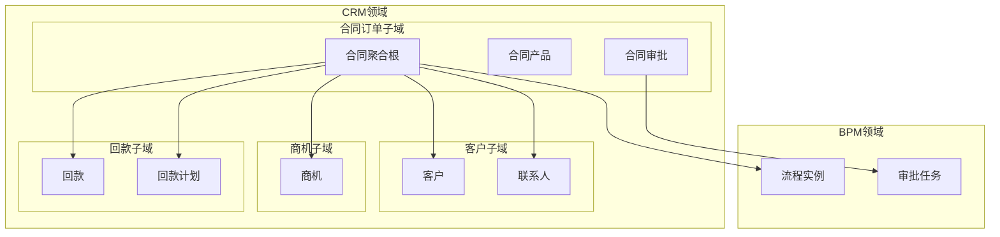
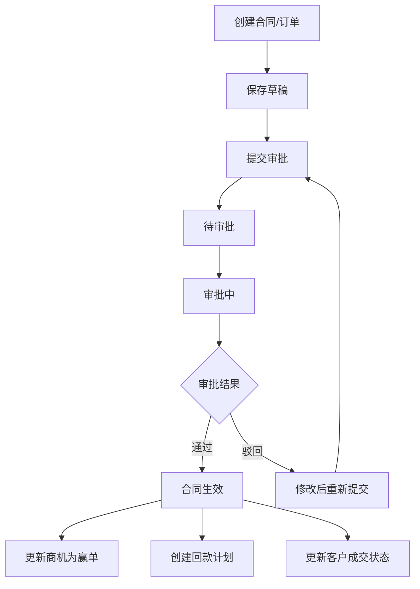
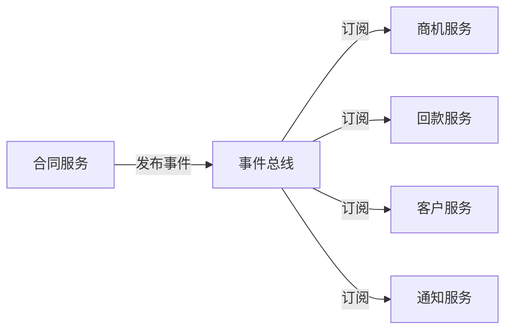
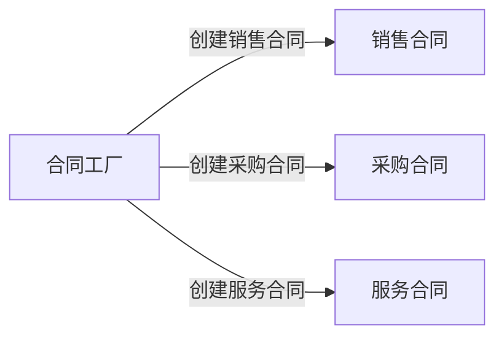

# GAP-007 阶段1：合同/订单映射与BPM审批集成 - DDD设计方案

> **任务来源**: 全CRM差异补齐任务分工与Git协同开发计划  
> **GAP编号**: GAP-007  
> **责任人**: 李祖豪（技术专员）  
> **设计日期**: 2026-07-14  
> **阶段**: S1 AISDD设计

---

## 一、领域分析

### 1.1 业务域边界



### 1.2 核心业务流程



---

## 二、聚合设计

### 2.1 合同聚合

**聚合根**: `CrmContractDO`

| 实体/值对象 | 类型 | 说明 |
|:---|:---|:---|
| `CrmContractDO` | 实体（聚合根） | 合同/订单主信息 |
| `CrmContractProductDO` | 实体 | 合同产品明细 |
| `ContractType` | 值对象 | 合同类型（销售/采购/服务） |
| `AuditStatus` | 值对象 | 审批状态 |
| `AuditRemark` | 值对象 | 审批意见 |

### 2.2 聚合边界

```
合同聚合
├── CrmContractDO（聚合根）
│   ├── id, no, name, customerId, businessId, ownerUserId
│   ├── contractType, auditStatus, processInstanceId
│   ├── orderDate, startTime, endTime
│   ├── totalPrice, discountPercent, totalProductPrice
│   ├── auditRemark, auditTime
│   └── remark
└── CrmContractProductDO（聚合成员）
    ├── contractId, productId
    ├── productPrice, contractPrice
    ├── count, totalPrice
    └── remark
```

### 2.3 聚合根职责

| 职责 | 方法 | 说明 |
|:---|:---|:---|
| 创建合同 | `create()` | 工厂方法，创建合同实例 |
| 提交审批 | `submitApproval()` | 状态变更为待审批 |
| 更新审批结果 | `updateAuditResult()` | 根据审批结果更新状态 |
| 撤回审批 | `revokeApproval()` | 状态回退为草稿 |
| 添加产品 | `addProduct()` | 添加合同产品 |
| 移除产品 | `removeProduct()` | 移除合同产品 |
| 计算总价 | `calculateTotalPrice()` | 计算合同总金额 |

---

## 三、领域事件

### 3.1 合同领域事件

| 事件名称 | 触发时机 | 事件内容 | 订阅者 |
|:---|:---|:---|:---|
| `ContractSubmittedEvent` | 合同提交审批 | contractId, auditStatus | BPM模块 |
| `ContractApprovedEvent` | 合同审批通过 | contractId, auditStatus | 商机模块、回款模块、客户模块 |
| `ContractRejectedEvent` | 合同审批驳回 | contractId, auditStatus, auditRemark | 通知模块 |
| `ContractRevokedEvent` | 合同撤回审批 | contractId, auditStatus | BPM模块 |

### 3.2 事件总线设计



---

## 四、领域服务

### 4.1 合同服务

**接口**: `CrmContractService`

| 方法 | 功能 | 事务性 |
|:---|:---|:---|
| `createContract()` | 创建合同 | 是 |
| `updateContract()` | 更新合同 | 是 |
| `deleteContract()` | 删除合同 | 是 |
| `submitContract()` | 提交审批 | 是 |
| `revokeContract()` | 撤回审批 | 是 |
| `updateContractAuditStatus()` | 更新审批结果 | 是 |
| `getContractApprovalProgress()` | 查询审批进度 | 否 |

### 4.2 审批服务

**接口**: `CrmContractAuditService`（内嵌在ContractService中）

| 方法 | 功能 | 说明 |
|:---|:---|:---|
| `handleApproved()` | 审批通过后动作 | 更新商机、创建回款计划 |
| `handleRejected()` | 审批驳回后动作 | 保存驳回意见、发送通知 |

---

## 五、仓储设计

### 5.1 合同仓储

**接口**: `CrmContractMapper`

| 方法 | 功能 | SQL类型 |
|:---|:---|:---|
| `insert()` | 插入合同 | INSERT |
| `updateById()` | 更新合同 | UPDATE |
| `deleteById()` | 删除合同 | DELETE |
| `selectById()` | 查询合同 | SELECT |
| `selectPage()` | 分页查询合同 | SELECT |
| `selectByCustomerId()` | 按客户查询合同 | SELECT |
| `selectByBusinessId()` | 按商机查询合同 | SELECT |
| `selectByOwnerUserId()` | 按负责人查询合同 | SELECT |

### 5.2 合同产品仓储

**接口**: `CrmContractProductMapper`

| 方法 | 功能 | SQL类型 |
|:---|:---|:---|
| `insert()` | 插入合同产品 | INSERT |
| `deleteByContractId()` | 删除合同产品 | DELETE |
| `selectByContractId()` | 查询合同产品 | SELECT |

---

## 六、工厂模式

### 6.1 合同工厂



| 工厂方法 | 说明 |
|:---|:---|
| `createSalesContract()` | 创建销售合同（contractType=1） |
| `createPurchaseContract()` | 创建采购合同（contractType=2） |
| `createServiceContract()` | 创建服务合同（contractType=3） |

---

## 七、值对象设计

### 7.1 ContractType 值对象

| 属性 | 类型 | 约束 |
|:---|:---|:---|
| `value` | Integer | 1-销售合同，2-采购合同，3-服务合同 |

### 7.2 AuditStatus 值对象

| 属性 | 类型 | 约束 |
|:---|:---|:---|
| `value` | Integer | 0-草稿，5-待审批，10-审批中，20-通过，30-驳回，40-撤回 |

---

## 八、领域驱动设计原则遵循

| 原则 | 实现方式 |
|:---|:---|
| 单一职责 | 合同聚合只负责合同相关业务，审批通过后通过领域事件通知其他模块 |
| 开闭原则 | 通过扩展枚举和字段实现新功能，不修改现有代码结构 |
| 依赖倒置 | 合同服务依赖BPM接口，不依赖具体实现 |
| 聚合根一致性 | 合同产品操作通过聚合根进行，保证数据一致性 |
| 事件驱动 | 通过领域事件实现模块解耦 |

---

**文档版本**: V1.0  
**创建日期**: 2026-07-14  
**责任人**: 李祖豪