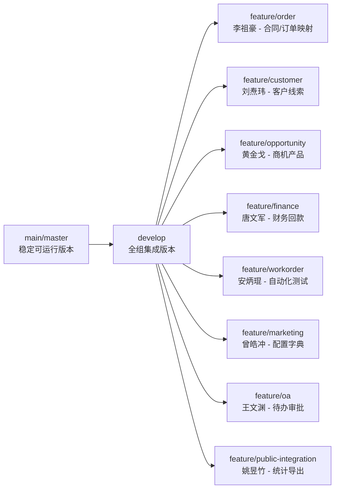
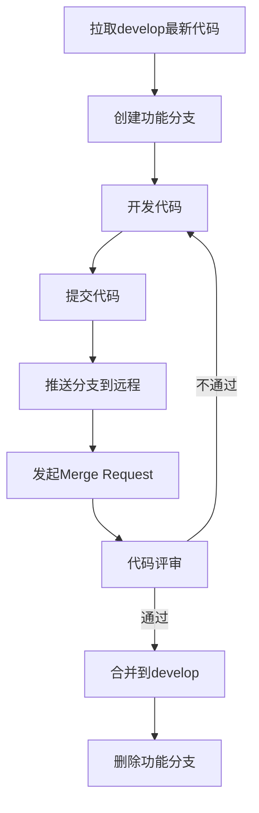
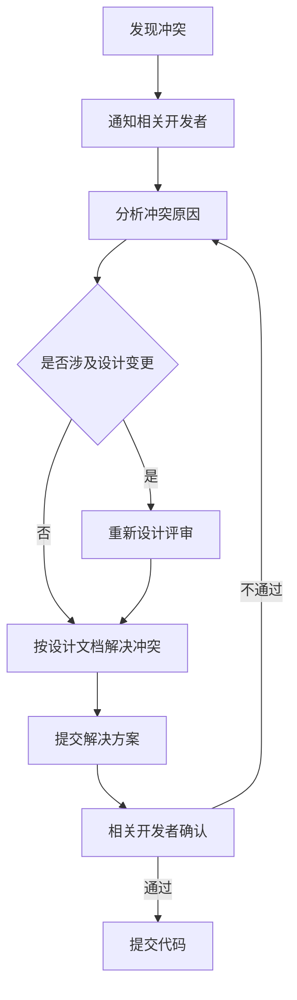

# GAP-007 阶段1：合同/订单映射与BPM审批集成 - Git方案

> **任务来源**: 全CRM差异补齐任务分工与Git协同开发计划  
> **GAP编号**: GAP-007  
> **责任人**: 李祖豪（技术专员）  
> **设计日期**: 2026-07-14  
> **阶段**: S1 AISDD设计

---

## 一、Git仓库结构

### 1.1 仓库信息

| 项目 | 内容 |
|:---|:---|
| 仓库地址 | `https://github.com/twj-programmer/R-U-I.git` |
| 主分支 | `main` / `master` |
| 集成分支 | `develop` |

### 1.2 分支结构



---

## 二、分支命名规范

### 2.1 分支命名规则

| 分支类型 | 命名格式 | 示例 |
|:---|:---|:---|
| 功能分支 | `feature/<模块>-<任务ID>-<简述>` | `feature/order-GAP007-contract-audit` |
| 集成分支 | `develop` | `develop` |
| 发布分支 | `release/<版本号>` | `release/v1.0.0` |
| 热修复分支 | `hotfix/<问题描述>` | `hotfix/contract-audit-fix` |

### 2.2 GAP-007 功能分支

| 分支名 | 说明 | 负责人 |
|:---|:---|:---|
| `feature/order-GAP007-contract-audit` | 合同/订单映射与BPM审批集成 | 李祖豪 |

---

## 三、Git工作流

### 3.1 开发流程



### 3.2 提交规范

| 类型 | 说明 | 示例 |
|:---|:---|:---|
| feat | 新功能 | `feat(GAP-007): 新增合同类型字段` |
| fix | 修复bug | `fix(GAP-007): 修复审批状态流转问题` |
| docs | 文档 | `docs(GAP-007): 更新API文档` |
| style | 代码格式 | `style(GAP-007): 格式化代码` |
| refactor | 重构 | `refactor(GAP-007): 重构审批服务` |
| test | 测试 | `test(GAP-007): 添加单元测试` |
| chore | 构建/工具 | `chore(GAP-007): 更新依赖` |

---

## 四、Git操作步骤

### 4.1 创建功能分支

```bash
# 拉取最新develop分支
git checkout develop
git pull origin develop

# 创建功能分支
git checkout -b feature/order-GAP007-contract-audit
```

### 4.2 开发提交

```bash
# 查看修改
git status

# 添加文件
git add .

# 提交代码（遵循commit规范）
git commit -m "feat(GAP-007): 新增合同类型字段和审批意见字段"
```

### 4.3 推送分支

```bash
# 推送分支到远程
git push -u origin feature/order-GAP007-contract-audit
```

### 4.4 发起合并请求

在GitHub上发起Merge Request，选择：
- 源分支：`feature/order-GAP007-contract-audit`
- 目标分支：`develop`

### 4.5 合并后清理

```bash
# 切换到develop
git checkout develop

# 拉取最新代码
git pull origin develop

# 删除本地功能分支
git branch -d feature/order-GAP007-contract-audit

# 删除远程功能分支
git push origin --delete feature/order-GAP007-contract-audit
```

---

## 五、Merge Request模板

```markdown
## 需求ID
- GAP-007

## 改动文件
- `Server/mitedtsm-module-crm/src/main/java/.../CrmContractDO.java` - 新增contractType、auditRemark、auditTime字段
- `Server/mitedtsm-module-crm/src/main/java/.../CrmAuditStatusEnum.java` - 新增WAIT_APPROVE状态
- `Server/mitedtsm-module-crm/src/main/java/.../CrmContractServiceImpl.java` - 扩展审批流程
- `database/new/20260714_crm_contract_order_mapping.sql` - 数据库迁移脚本

## 数据库变更
- 新增字段：contract_type, audit_remark, audit_time
- 新增索引：idx_crm_contract_type
- 新增字典：合同类型（crm_contract_type）

## 测试结果
- [x] 单元测试通过
- [x] 接口测试通过
- [x] 功能测试通过
- [x] 权限测试通过

## 截图
（如有需要）

## 风险
- BPM流程定义需确认已部署

## 回滚说明
- 执行数据库回滚脚本
- 恢复代码到上一版本
```

---

## 六、代码评审要点

### 6.1 评审检查项

| 检查项 | 说明 |
|:---|:---|
| 需求覆盖 | 是否覆盖GAP-007所有需求 |
| 代码质量 | 是否符合项目编码规范 |
| 测试覆盖 | 是否有单元测试 |
| 权限校验 | 是否有完整的权限校验 |
| 异常处理 | 是否有完整的异常处理 |
| 数据库变更 | 是否有迁移脚本 |
| API文档 | 是否有API文档 |

### 6.2 评审人

| 角色 | 评审内容 |
|:---|:---|
| 王文渊 | 需求覆盖、业务逻辑 |
| 李祖豪 | 技术实现、代码质量 |
| 安炳琨 | 测试覆盖、异常处理 |

---

## 七、冲突处理

### 7.1 常见冲突场景

| 场景 | 处理方式 |
|:---|:---|
| 多人修改同一文件 | 先登记文件所有权；冲突由李祖豪按设计处理 |
| 数据库迁移冲突 | 按执行顺序合并迁移脚本 |
| API冲突 | 按API版本协调 |

### 7.2 冲突处理流程



---

## 八、分支保护规则

### 8.1 main分支保护

| 规则 | 设置 |
|:---|:---|
| 需要代码评审 | ✅ |
| 需要通过状态检查 | ✅ |
| 需要线性历史 | ✅ |
| 禁止强制推送 | ✅ |

### 8.2 develop分支保护

| 规则 | 设置 |
|:---|:---|
| 需要代码评审 | ✅ |
| 需要通过状态检查 | ✅ |
| 需要线性历史 | ✅ |
| 禁止强制推送 | ✅ |

---

## 九、版本管理

### 9.1 版本命名规则

| 版本类型 | 格式 | 示例 |
|:---|:---|:---|
| 开发版本 | `develop-<日期>` | `develop-20260714` |
| 发布版本 | `v<主版本>.<次版本>.<修订版本>` | `v1.0.0` |

### 9.2 版本标签

```bash
# 创建版本标签
git tag -a v1.0.0 -m "CRM合同/订单映射与BPM审批集成完成"

# 推送标签到远程
git push origin v1.0.0
```

---

## 十、Git协同约定

### 10.1 每日同步

| 时间 | 操作 |
|:---|:---|
| 早上 | 拉取develop最新代码 |
| 晚上 | 推送功能分支到远程 |

### 10.2 冲突预防

| 措施 | 说明 |
|:---|:---|
| 小步提交 | 每次提交只包含一个完整功能 |
| 频繁推送 | 每天至少推送一次 |
| 定期同步 | 每天同步develop分支 |

### 10.3 禁止操作

| 操作 | 原因 |
|:---|:---|
| 直接push到main/develop | 破坏分支保护规则 |
| 强制推送 | 覆盖他人代码 |
| 提交敏感信息 | 安全风险 |
| 提交构建产物 | 仓库膨胀 |

---

**文档版本**: V1.0  
**创建日期**: 2026-07-14  
**责任人**: 李祖豪