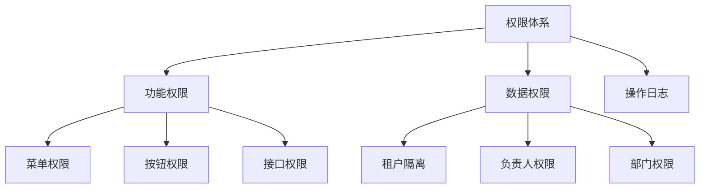
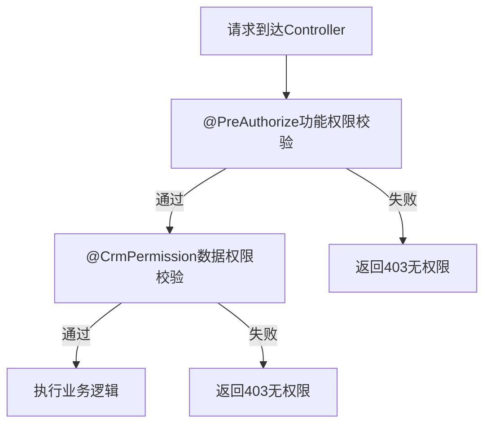

# GAP-007 阶段1：合同/订单映射与BPM审批集成 - 权限方案

> **任务来源**: 全CRM差异补齐任务分工与Git协同开发计划  
> **GAP编号**: GAP-007  
> **责任人**: 李祖豪（技术专员）  
> **设计日期**: 2026-07-14  
> **阶段**: S1 AISDD设计

---

## 一、权限体系架构



---

## 二、功能权限设计

### 2.1 菜单权限

| 菜单路径 | 菜单名称 | 权限标识 | 说明 |
|:---|:---|:---|:---|
| `/crm/contract` | 合同管理 | `crm:contract` | 合同模块根菜单 |
| `/crm/contract/list` | 合同列表 | `crm:contract:query` | 合同列表查看 |
| `/crm/contract/create` | 创建合同 | `crm:contract:create` | 创建合同 |
| `/crm/contract/edit` | 编辑合同 | `crm:contract:update` | 编辑合同 |
| `/crm/contract/delete` | 删除合同 | `crm:contract:delete` | 删除合同 |
| `/crm/contract/submit` | 提交审批 | `crm:contract:update` | 提交审批 |
| `/crm/contract/revoke` | 撤回审批 | `crm:contract:update` | 撤回审批 |
| `/crm/contract/approval-progress` | 审批进度 | `crm:contract:query` | 查看审批进度 |

### 2.2 按钮权限

| 按钮名称 | 权限标识 | 关联菜单 | 说明 |
|:---|:---|:---|:---|
| 新增合同 | `crm:contract:create` | 合同列表 | 创建新合同 |
| 编辑合同 | `crm:contract:update` | 合同列表/详情 | 编辑合同信息 |
| 删除合同 | `crm:contract:delete` | 合同列表/详情 | 删除合同 |
| 提交审批 | `crm:contract:update` | 合同详情 | 提交审批 |
| 撤回审批 | `crm:contract:update` | 合同详情 | 撤回审批 |
| 查看审批进度 | `crm:contract:query` | 合同列表/详情 | 查看审批进度 |

### 2.3 接口权限

| API路径 | 方法 | 权限标识 | 说明 |
|:---|:---|:---|:---|
| `/crm/contract/create` | POST | `crm:contract:create` | 创建合同 |
| `/crm/contract/update` | PUT | `crm:contract:update` | 更新合同 |
| `/crm/contract/delete` | DELETE | `crm:contract:delete` | 删除合同 |
| `/crm/contract/get` | GET | `crm:contract:query` | 查询合同详情 |
| `/crm/contract/page` | GET | `crm:contract:query` | 分页查询合同 |
| `/crm/contract/submit` | PUT | `crm:contract:update` | 提交审批 |
| `/crm/contract/revoke` | PUT | `crm:contract:update` | 撤回审批 |
| `/crm/contract/approval-progress` | GET | `crm:contract:query` | 查询审批进度 |

---

## 三、数据权限设计

### 3.1 数据权限模型

| 权限类型 | 说明 | 数据过滤字段 |
|:---|:---|:---|
| 全部数据 | 查看所有合同 | 无过滤 |
| 本部门数据 | 查看本部门合同 | `department_id` |
| 本部门及下属部门数据 | 查看本部门及下属部门合同 | `department_id` |
| 本人数据 | 查看自己负责的合同 | `owner_user_id` |

### 3.2 角色数据权限配置

| 角色 | 数据权限类型 | 说明 |
|:---|:---|:---|
| 系统管理员 | 全部数据 | 无限制 |
| 销售总监 | 本部门及下属部门数据 | 查看销售部门合同 |
| 销售经理 | 本部门数据 | 查看本部门合同 |
| 销售代表 | 本人数据 | 查看自己负责的合同 |
| 财务专员 | 全部数据 | 业务需要 |
| 审批人 | 全部数据 | 审批需要 |

### 3.3 数据权限实现方式

```java
@CrmPermission(bizType = CrmBizTypeEnum.CRM_CONTRACT, bizId = "#id", level = CrmPermissionLevelEnum.WRITE)
public void updateContract(CrmContractSaveReqVO reqVO) {
    // 数据权限校验由注解自动完成
}
```

---

## 四、审批权限设计

### 4.1 审批操作权限

| 操作 | 权限要求 | 说明 |
|:---|:---|:---|
| 提交审批 | 合同负责人或有修改权限 | 只能提交自己负责的合同或有修改权限的合同 |
| 撤回审批 | 合同发起人 | 只能撤回自己发起的审批 |
| 审批通过/驳回 | BPM分配的审批人 | 由BPM流程决定审批人 |
| 更新审批结果 | 内部调用 | BPM回调，无需权限校验 |

### 4.2 审批状态权限

| 当前状态 | 可执行操作 | 权限要求 |
|:---|:---|:---|
| 草稿 | 提交审批 | 负责人或有修改权限 |
| 待审批 | 撤回审批 | 发起人 |
| 审批中 | 撤回审批 | 发起人 |
| 审批中 | 通过/驳回 | 审批人（BPM控制） |
| 已通过 | 无 | 不可修改 |
| 已驳回 | 重新提交审批 | 负责人或有修改权限 |
| 已撤回 | 提交审批 | 负责人或有修改权限 |

---

## 五、权限注解使用规范

### 5.1 @CrmPermission 注解

| 参数 | 说明 | 示例 |
|:---|:---|:---|
| bizType | 业务类型 | `CrmBizTypeEnum.CRM_CONTRACT` |
| bizId | 业务ID | `#id` |
| level | 权限级别 | `CrmPermissionLevelEnum.WRITE` |

### 5.2 @PreAuthorize 注解

| 参数 | 说明 | 示例 |
|:---|:---|:---|
| hasPermission | 功能权限校验 | `@PreAuthorize("hasPermission('crm:contract:create')")` |

### 5.3 权限校验流程



---

## 六、操作日志

### 6.1 日志记录类型

| 操作类型 | 日志标识 | 说明 |
|:---|:---|:---|
| 创建合同 | `CRM_CONTRACT_TYPE` + `CRM_CONTRACT_CREATE_SUB_TYPE` | 创建合同 |
| 更新合同 | `CRM_CONTRACT_TYPE` + `CRM_CONTRACT_UPDATE_SUB_TYPE` | 更新合同 |
| 删除合同 | `CRM_CONTRACT_TYPE` + `CRM_CONTRACT_DELETE_SUB_TYPE` | 删除合同 |
| 提交审批 | `CRM_CONTRACT_TYPE` + `CRM_CONTRACT_SUBMIT_SUB_TYPE` | 提交审批 |
| 撤回审批 | `CRM_CONTRACT_TYPE` + `CRM_CONTRACT_SUBMIT_SUB_TYPE` | 撤回审批 |
| 更新审批状态 | `CRM_CONTRACT_TYPE` + `CRM_CONTRACT_AUDIT_SUB_TYPE` | 更新审批状态 |

### 6.2 日志记录实现

```java
@LogRecord(type = CRM_CONTRACT_TYPE, subType = CRM_CONTRACT_CREATE_SUB_TYPE, 
        bizNo = "{{#result.id}}", success = CRM_CONTRACT_CREATE_SUCCESS)
public CrmContractDO createContract(CrmContractSaveReqVO reqVO) {
    // 业务逻辑
}
```

---

## 七、权限配置初始化

### 7.1 菜单初始化SQL

```sql
-- 合同管理菜单
INSERT INTO system_menu (name, path, parent_id, sort, icon, component, permission, status, creator, create_time)
VALUES 
    ('合同管理', '/crm/contract', (SELECT id FROM system_menu WHERE name = 'CRM'), 3, 'contract', 'crm/contract/list', 'crm:contract', 0, '1', NOW()),
    ('合同列表', '/crm/contract/list', (SELECT id FROM system_menu WHERE name = '合同管理'), 1, '', 'crm/contract/list', 'crm:contract:query', 0, '1', NOW());
```

### 7.2 权限标识初始化

```sql
-- 合同权限标识
INSERT INTO system_role_menu (role_id, menu_id)
SELECT r.id, m.id 
FROM system_role r, system_menu m 
WHERE r.name = '系统管理员' AND m.permission LIKE 'crm:contract%';
```

---

**文档版本**: V1.0  
**创建日期**: 2026-07-14  
**责任人**: 李祖豪